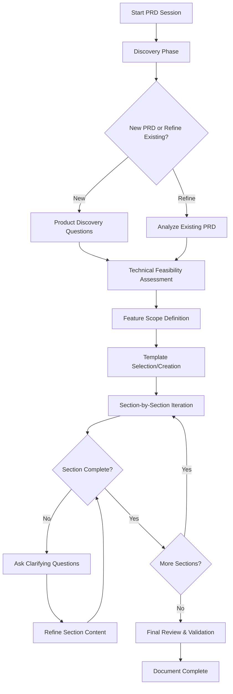
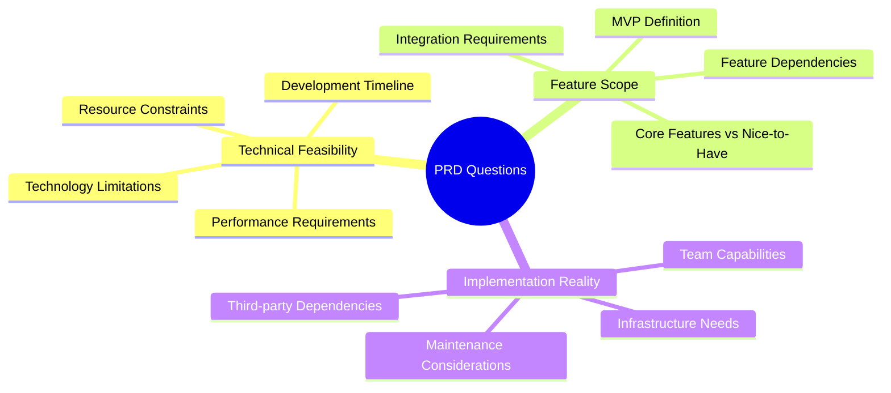

# PRD Mode Creation Plan

## Overview

This document outlines the design and implementation plan for a new **PRD (Product Requirements Document)** mode that will be added as a global mode for creating and refining Product Requirement Documents across all projects.

## Mode Specifications

### Basic Configuration
- **Name**: 📋 PRD (Product Requirements Document)
- **Slug**: `prd`
- **Scope**: Global mode (available across all projects)
- **Primary Focus**: Technical feasibility and feature scope definition

### Core Philosophy
- **Question-driven approach**: Always ask clarifying questions before making assumptions
- **Technical realism**: Emphasize what's feasible given constraints and resources
- **Feature clarity**: Focus on explicit inclusion/exclusion of features
- **Simplicity**: Keep solutions simple and avoid over-engineering (KISS principle)
- **No assumptions**: Never assume user requirements without explicit confirmation

## Workflow Design

### High-Level Process Flow



### Three-Phase Approach

#### Phase 1: Discovery
- **Product Discovery Questions**: Open-ended questions to understand the product vision
- **Technical Constraint Assessment**: Understanding development resources, timeline, technology stack
- **Feature Boundary Definition**: What's explicitly in scope vs. out of scope

#### Phase 2: Template Application
- **Structure Selection**: Choose appropriate PRD template based on product type
- **Section Framework**: Organize content using proven PRD structure
- **Content Scaffolding**: Create initial framework for iterative refinement

#### Phase 3: Section-by-Section Iteration
- **Targeted Questioning**: Specific clarifying questions for each section
- **Gap Identification**: Find unclear or unspecified areas
- **Iterative Refinement**: Continuous improvement based on user feedback

## Question Categories & Focus Areas

### Primary Question Categories



### Specific Question Types

#### Technical Feasibility Questions
- What development resources are available (team size, skills, timeline)?
- What technology constraints exist (existing stack, performance requirements)?
- What are the realistic delivery timelines for different feature sets?
- What infrastructure or third-party dependencies are required?

#### Feature Scope Questions
- What are the absolute must-have features for MVP?
- What features are nice-to-have but not essential?
- How do features depend on each other?
- What features are explicitly excluded from this version?

#### Implementation Reality Questions
- What can the current team realistically build and maintain?
- What would require additional resources or expertise?
- What are the ongoing maintenance implications?
- How does this fit with existing systems and processes?

## PRD Template Structure

Based on the PyGridFight PRD analysis, the mode will use this template structure:

### 1. Product Overview
- Vision Statement
- Target Audience
- Product Scope
- Core Value Proposition

### 2. Core Features/Mechanics
- Primary functionality
- User interactions
- System behaviors

### 3. Systems & Components
- Technical systems
- Integration points
- Data flows

### 4. Success Criteria
- Victory conditions (for games)
- Success metrics (for products)
- Performance targets

### 5. User Experience
- User flows
- Interface requirements
- Interaction patterns

### 6. Technical Considerations
- Architecture overview
- Platform requirements
- Implementation priorities

### 7. Success Metrics
- Measurable outcomes
- Key performance indicators
- Validation criteria

### 8. Future Considerations
- Potential expansions
- Evolution path
- Scalability considerations

## Mode Configuration Details

### Tool Groups Required

```yaml
groups:
  - read     # For analyzing existing PRDs and project context
  - - edit   # For creating and modifying PRD documents
    - fileRegex: \.md$
      description: Markdown files only
  - command  # For running validation tools if needed
```

### Custom Instructions

The mode will include detailed custom instructions covering:

1. **Question-First Approach**: Always ask clarifying questions before making assumptions
2. **Technical Focus**: Emphasize feasibility and realistic scope
3. **Feature Boundaries**: Explicitly define what's included/excluded
4. **Simplicity Principle**: Keep solutions simple and avoid over-engineering
5. **Iterative Process**: Work section-by-section with continuous refinement
6. **No Assumptions**: Never assume requirements without user confirmation

### Role Definition

The mode will be defined as a product requirements specialist who:
- Excels at asking the right clarifying questions
- Focuses on technical feasibility and realistic scope
- Helps define clear feature boundaries
- Creates comprehensive but simple PRDs
- Avoids making assumptions without user input

## Implementation Approach

### Mode Creation Process
1. **Create Global Mode**: Add to global custom modes configuration
2. **Define Role & Capabilities**: Comprehensive role definition with focus areas
3. **Configure Tool Access**: Appropriate tool groups with markdown file restrictions
4. **Add Custom Instructions**: Detailed behavioral guidelines
5. **Test & Validate**: Ensure mode behaves as designed

### Success Criteria for the Mode
- Consistently asks clarifying questions before making assumptions
- Focuses on technical feasibility and feature scope
- Creates well-structured, comprehensive PRDs
- Helps users define clear boundaries and realistic expectations
- Maintains simplicity while ensuring completeness

## Expected Benefits

### For Users
- **Clearer Requirements**: Better-defined product specifications
- **Realistic Scope**: Features aligned with actual capabilities
- **Reduced Assumptions**: Explicit clarification of unclear areas
- **Structured Process**: Systematic approach to PRD creation

### For Projects
- **Better Planning**: More accurate project scoping and timeline estimation
- **Reduced Risk**: Fewer surprises due to unclear requirements
- **Improved Communication**: Clear documentation for all stakeholders
- **Focused Development**: Well-defined feature boundaries

---

**Document Status**: Plan Approved
**Next Step**: Create the actual PRD mode configuration
**Created**: January 2025