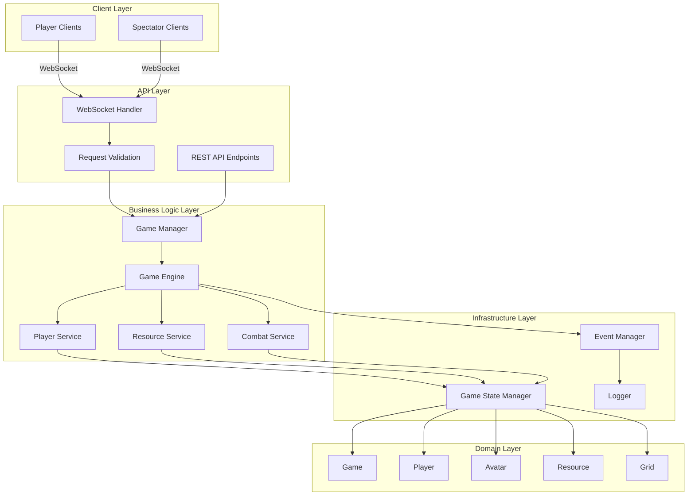

# PyGridFight Implementation Plan

## 1. Technology Stack

### Core Technologies
- **Language**: Python 3.12+
- **Package Manager**: uv (modern, fast Python package manager)
- **Web Framework**: FastAPI (async, modern, with built-in OpenAPI support)
- **Data Validation**: Pydantic v2 (type safety and validation)
- **WebSockets**: Native FastAPI WebSockets
- **Testing**: pytest with pytest-asyncio for async tests
- **Logging**: structlog (structured logging with excellent async support)

### Development Tools
- **Code Quality**: ruff (fast linter and formatter)
- **Type Checking**: mypy
- **Pre-commit Hooks**: pre-commit
- **Documentation**: MkDocs with Material theme

## 2. Project Architecture



## 3. Directory Structure

```
PyGridFight/
├── src/
│   └── pygridfight/
│       ├── __init__.py
│       ├── main.py              # FastAPI app entry point
│       ├── api/
│       │   ├── __init__.py
│       │   ├── websocket.py     # WebSocket handlers
│       │   ├── rest.py          # REST endpoints
│       │   └── schemas/         # Pydantic models
│       │       ├── __init__.py
│       │       ├── game.py
│       │       ├── player.py
│       │       ├── actions.py
│       │       └── messages.py
│       ├── core/
│       │   ├── __init__.py
│       │   ├── config.py        # Configuration management
│       │   ├── logging.py       # Logging setup
│       │   └── exceptions.py    # Custom exceptions
│       ├── domain/
│       │   ├── __init__.py
│       │   ├── models/
│       │   │   ├── __init__.py
│       │   │   ├── game.py
│       │   │   ├── player.py
│       │   │   ├── avatar.py
│       │   │   ├── grid.py
│       │   │   └── resource.py
│       │   └── enums.py         # Game enums
│       ├── services/
│       │   ├── __init__.py
│       │   ├── game_manager.py
│       │   ├── game_engine.py
│       │   ├── player_service.py
│       │   ├── resource_service.py
│       │   └── combat_service.py
│       └── infrastructure/
│           ├── __init__.py
│           ├── game_state.py    # In-memory state management
│           └── events.py        # Event system
├── tests/
│   ├── __init__.py
│   ├── conftest.py
│   ├── unit/
│   └── integration/
├── docs/
│   ├── api/
│   └── architecture/
├── scripts/
├── pyproject.toml
├── .gitignore
├── README.md
└── Makefile
```

## 4. Key Design Patterns & Principles

### 4.1 Domain-Driven Design
- Clear separation between domain models and API schemas
- Rich domain models with business logic
- Services handle orchestration

### 4.2 Event-Driven Architecture
```python
# Example event flow
PlayerAction -> GameEngine -> StateChange -> EventManager -> Broadcast to Clients
```

### 4.3 Dependency Injection
- Use FastAPI's dependency injection for services
- Easy testing and mocking

### 4.4 Repository Pattern (Simplified)
- GameStateManager acts as in-memory repository
- Easy to swap for Redis later

## 5. Core Components Design

### 5.1 WebSocket Message Protocol

```python
# Incoming messages
class ActionMessage(BaseModel):
    type: ActionType  # move, attack, collect, purchase
    player_id: str
    avatar_id: int
    data: dict  # Action-specific data

# Outgoing messages
class StateUpdateMessage(BaseModel):
    type: Literal["state_update"]
    game_state: GameState
    timestamp: datetime

class ErrorMessage(BaseModel):
    type: Literal["error"]
    code: str
    message: str
```

### 5.2 Game State Management

```python
class GameStateManager:
    """In-memory game state management"""
    _games: dict[str, Game] = {}
    _player_connections: dict[str, WebSocket] = {}

    async def create_game(self, game_id: str) -> Game
    async def get_game(self, game_id: str) -> Game
    async def update_game(self, game_id: str, game: Game) -> None
    async def broadcast_state(self, game_id: str) -> None
```

### 5.3 Testing Strategy

- **Unit Tests**: Test individual services and domain logic
- **Integration Tests**: Test API endpoints and WebSocket handlers
- **Property-Based Tests**: Test game invariants using hypothesis

Example test structure:
```python
# tests/unit/test_game_engine.py
async def test_avatar_movement():
    """Test avatar can move to adjacent cells"""

# tests/unit/test_combat_service.py
async def test_combat_resolution():
    """Test attacker always wins combat"""

# tests/integration/test_websocket.py
async def test_player_connection():
    """Test player can connect and receive game state"""
```

## 6. Implementation Phases

### Phase 1: Foundation (Week 1)
- Project setup with uv
- Core domain models
- Basic FastAPI app structure
- Logging configuration
- Initial tests setup

### Phase 2: Core Game Logic (Week 2)
- Grid system implementation
- Avatar movement and positioning
- Basic game state management
- Player management

### Phase 3: WebSocket API (Week 3)
- WebSocket connection handling
- Message validation and routing
- State synchronization
- Error handling

### Phase 4: Game Features (Week 4)
- Combat system
- Resource spawning and collection
- Victory conditions
- Power-ups

### Phase 5: Polish & Testing (Week 5)
- Comprehensive testing
- API documentation
- Performance optimization
- Spectator mode

## 7. Configuration Management

```python
# Using Pydantic Settings
from pydantic_settings import BaseSettings

class GameSettings(BaseSettings):
    grid_size: int = 8
    max_players: int = 4
    max_avatars_per_player: int = 3
    avatar_cost: int = 5
    target_score: int = 20
    max_turns: int = 50

class ServerSettings(BaseSettings):
    host: str = "0.0.0.0"
    port: int = 8000
    cors_origins: list[str] = ["*"]
    log_level: str = "INFO"

    class Config:
        env_prefix = "PYGRIDFIGHT_"
```

## 8. Logging Strategy

```python
# Using structlog
import structlog

# Configuration
structlog.configure(
    processors=[
        structlog.stdlib.filter_by_level,
        structlog.stdlib.add_logger_name,
        structlog.stdlib.add_log_level,
        structlog.stdlib.PositionalArgumentsFormatter(),
        structlog.processors.TimeStamper(fmt="iso"),
        structlog.processors.StackInfoRenderer(),
        structlog.processors.format_exc_info,
        structlog.processors.UnicodeDecoder(),
        structlog.processors.JSONRenderer()
    ],
    context_class=dict,
    logger_factory=structlog.stdlib.LoggerFactory(),
    cache_logger_on_first_use=True,
)

# Example usage
logger = structlog.get_logger()

logger.info(
    "game_action",
    game_id=game_id,
    player_id=player_id,
    action_type=action.type,
    position={"x": x, "y": y}
)
```

## 9. API Documentation

### 9.1 REST Endpoints
- FastAPI automatic OpenAPI generation
- Available at `/docs` (Swagger UI) and `/redoc`

### 9.2 WebSocket Protocol Documentation
Custom documentation for WebSocket messages:

```yaml
# Connection Flow
1. Client connects to ws://host:port/ws/{game_id}
2. Client sends join message with display name
3. Server responds with initial game state
4. Client sends actions, server broadcasts state updates

# Message Types
- connect: Initial connection with display name
- move: Move avatar to adjacent cell
- attack: Attack enemy avatar
- collect: Collect resource at current position
- purchase: Buy new avatar with currency
```

## 10. Development Workflow

### 10.1 Makefile Commands

```makefile
.PHONY: install format lint test run docs

install:
	uv pip install -e ".[dev]"

format:
	ruff format src tests

lint:
	ruff check src tests
	mypy src

test:
	pytest tests -v --cov=pygridfight

test-unit:
	pytest tests/unit -v

test-integration:
	pytest tests/integration -v

run:
	uvicorn pygridfight.main:app --reload --host 0.0.0.0 --port 8000

docs:
	mkdocs serve

clean:
	find . -type d -name __pycache__ -exec rm -rf {} +
	find . -type f -name "*.pyc" -delete
```

### 10.2 Pre-commit Configuration

```yaml
# .pre-commit-config.yaml
repos:
  - repo: https://github.com/astral-sh/ruff-pre-commit
    rev: v0.1.0
    hooks:
      - id: ruff
      - id: ruff-format
  - repo: https://github.com/pre-commit/mirrors-mypy
    rev: v1.0.0
    hooks:
      - id: mypy
        additional_dependencies: [pydantic, fastapi]
```

## 11. Error Handling Strategy

### 11.1 Custom Exceptions

```python
class PyGridFightException(Exception):
    """Base exception for all game errors"""

class GameNotFoundException(PyGridFightException):
    """Raised when game doesn't exist"""

class InvalidActionException(PyGridFightException):
    """Raised when action is invalid"""

class PlayerLimitException(PyGridFightException):
    """Raised when game is full"""
```

### 11.2 WebSocket Error Handling

```python
async def handle_websocket_error(websocket: WebSocket, error: Exception):
    error_message = ErrorMessage(
        type="error",
        code=error.__class__.__name__,
        message=str(error)
    )
    await websocket.send_json(error_message.dict())
```

## 12. Performance Considerations

- Use asyncio for all I/O operations
- Implement connection pooling for WebSockets
- Use Pydantic's model validation caching
- Profile critical game loops
- Consider using uvloop for better async performance

---

**Document Version**: 1.0
**Created**: January 2025
**Status**: Ready for Implementation