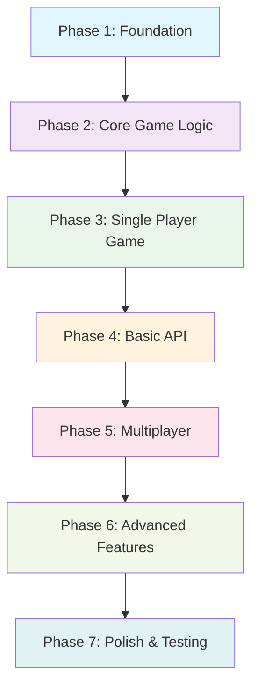

# PyGridFight Implementation Plan

## Overview

This plan follows a **minimal working game first** approach, building incrementally from basic functionality to full multiplayer features. We'll use **hybrid TDD** - writing tests for domain models and critical paths while deferring API/integration tests until later phases.

## Implementation Strategy



## Phase 1: Foundation & Project Structure
**Goal**: Set up the project structure and basic dependencies

### Step 1.1: Project Dependencies Setup
- **Commit**: `build: add required dependencies for FastAPI and WebSocket support`
- **Tasks**:
  - Add `uvicorn` for ASGI server
  - Add `websockets` for WebSocket support
  - Add development dependencies for testing WebSocket clients
- **Testing**: No tests needed (dependency setup)

### Step 1.2: Create Module Structure
- **Commit**: `feat: create DDD-based module structure`
- **Tasks**:
  - Create directory structure following [`documents/PyGridFight_Architecture.md:169-209`](documents/PyGridFight_Architecture.md:169-209)
  - Add `__init__.py` files for all packages
  - Create placeholder exception files
- **Testing**: No tests needed (scaffolding)

```
src/pygridfight/
├── main.py
├── core/
│   ├── __init__.py
│   ├── enums.py
│   ├── models.py
│   └── utils.py
├── game_lifecycle/
│   ├── __init__.py
│   ├── manager.py
│   ├── models.py
│   └── exceptions.py
├── gameplay/
│   ├── __init__.py
│   ├── session.py
│   ├── player.py
│   ├── avatar.py
│   ├── grid.py
│   ├── resources.py
│   ├── actions.py
│   ├── events.py
│   └── exceptions.py
├── scoring/
│   ├── __init__.py
│   ├── services.py
│   ├── models.py
│   └── exceptions.py
└── api/
    ├── __init__.py
    ├── websockets.py
    └── schemas.py
```

## Phase 2: Core Game Logic (Domain Models)
**Goal**: Implement the essential domain models with tests

### Step 2.1: Core Value Objects
- **Commit**: `feat: implement core value objects (Coordinates, enums)`
- **Tasks**:
  - Implement [`Coordinates`](documents/PyGridFight_Architecture.md:77) value object in `core/models.py`
  - Implement all enums in `core/enums.py` ([`GameStatusEnum`](documents/PyGridFight_Architecture.md:106), [`ResourceTypeEnum`](documents/PyGridFight_Architecture.md:107), etc.)
- **Testing**: Unit tests for value object validation and immutability

### Step 2.2: Grid and Cell System
- **Commit**: `feat: implement grid system with cell management`
- **Tasks**:
  - Implement [`Cell`](documents/PyGridFight_Architecture.md:96) value object
  - Implement [`Grid`](documents/PyGridFight_Architecture.md:92-94) entity with basic operations
  - Grid initialization, cell access, validation methods
- **Testing**: Unit tests for grid operations, boundary validation, cell state management

### Step 2.3: Avatar Entity
- **Commit**: `feat: implement avatar entity with movement logic`
- **Tasks**:
  - Implement [`Avatar`](documents/PyGridFight_Architecture.md:89-91) entity
  - Movement validation and execution
  - Position tracking
- **Testing**: Unit tests for avatar movement, boundary checking, position updates

### Step 2.4: Resource System
- **Commit**: `feat: implement resource system and collection logic`
- **Tasks**:
  - Implement [`Resource`](documents/PyGridFight_Architecture.md:97) value object
  - Resource spawning logic in Grid
  - Collection mechanics
- **Testing**: Unit tests for resource creation, spawning, and collection

## Phase 3: Single Player Game Logic
**Goal**: Create a working single-player game that can be tested locally

### Step 3.1: Player Entity
- **Commit**: `feat: implement player entity with avatar management`
- **Tasks**:
  - Implement [`Player`](documents/PyGridFight_Architecture.md:86-88) entity
  - Avatar collection management
  - Currency tracking
- **Testing**: Unit tests for player state management, avatar operations

### Step 3.2: Basic Scoring System
- **Commit**: `feat: implement basic scoring system`
- **Tasks**:
  - Implement [`ScoreKeeper`](documents/PyGridFight_Architecture.md:114-116) service
  - Point calculation and tracking
  - Basic victory condition checking
- **Testing**: Unit tests for score calculations and victory conditions

### Step 3.3: Game Session (Single Player)
- **Commit**: `feat: implement single-player game session`
- **Tasks**:
  - Implement simplified [`GameSession`](documents/PyGridFight_Architecture.md:83-85) for single player
  - Turn processing for one player
  - Resource spawning integration
  - Game state management
- **Testing**: Integration tests for complete single-player game flow

### Step 3.4: Action System
- **Commit**: `feat: implement action system (move, collect, purchase)`
- **Tasks**:
  - Implement [`Action`](documents/PyGridFight_Architecture.md:99-102) command objects
  - Action validation and processing
  - State updates from actions
- **Testing**: Unit tests for each action type and validation

## Phase 4: Basic API Layer
**Goal**: Create a simple API to interact with the game

### Step 4.1: Basic FastAPI Setup
- **Commit**: `feat: create basic FastAPI application with health check`
- **Tasks**:
  - Set up FastAPI app in `main.py`
  - Add basic health check endpoint
  - Configure CORS if needed
- **Testing**: Basic API health check test

### Step 4.2: WebSocket Connection Handling
- **Commit**: `feat: implement basic WebSocket connection management`
- **Tasks**:
  - Basic WebSocket endpoint at `/ws`
  - Connection/disconnection handling
  - Simple message echo for testing
- **Testing**: Manual testing with WebSocket client

### Step 4.3: Game State API
- **Commit**: `feat: implement game state broadcasting via WebSocket`
- **Tasks**:
  - JSON serialization of game state
  - State broadcasting to connected clients
  - Basic message schemas
- **Testing**: Manual testing with simple client

## Phase 5: Multiplayer Foundation
**Goal**: Extend to support multiple players

### Step 5.1: Game Lifecycle Management
- **Commit**: `feat: implement game lifecycle management for multiplayer`
- **Tasks**:
  - Implement [`GameManager`](documents/PyGridFight_Architecture.md:70-72) service
  - Player connection tracking
  - Game session creation and management
- **Testing**: Unit tests for game lifecycle operations

### Step 5.2: Multiplayer Game Session
- **Commit**: `feat: extend game session for multiplayer support`
- **Tasks**:
  - Extend GameSession for 2-4 players
  - Turn-based mechanics
  - Player synchronization
- **Testing**: Integration tests for multiplayer game flow

### Step 5.3: Player Action Processing
- **Commit**: `feat: implement multiplayer action processing and validation`
- **Tasks**:
  - Action validation per player
  - Turn management
  - State synchronization after actions
- **Testing**: Integration tests for action processing

### Step 5.4: WebSocket Message Protocol
- **Commit**: `feat: implement complete WebSocket message protocol`
- **Tasks**:
  - Implement message schemas from [`documents/PyGridFight_PRD.md:147-155`](documents/PyGridFight_PRD.md:147-155)
  - Action message handling (move, collect, purchase)
  - Error message handling
- **Testing**: Manual testing with multiple clients

## Phase 6: Advanced Features
**Goal**: Add remaining game features

### Step 6.1: Power-up System
- **Commit**: `feat: implement power-up system with temporary effects`
- **Tasks**:
  - Implement [`ActivePowerUp`](documents/PyGridFight_Architecture.md:98) value object
  - Power-up collection and activation
  - Temporary effect management (speed boost)
- **Testing**: Unit tests for power-up mechanics

### Step 6.2: Avatar Purchase System
- **Commit**: `feat: implement avatar purchase and spawning system`
- **Tasks**:
  - Avatar purchase validation
  - Spawn point management
  - Currency deduction
- **Testing**: Unit tests for purchase validation and spawning

### Step 6.3: Advanced Victory Conditions
- **Commit**: `feat: implement complete victory condition system`
- **Tasks**:
  - Implement [`VictoryConditionChecker`](documents/PyGridFight_Architecture.md:117-118)
  - Multiple victory scenarios (score, time limit, tie-breaking)
  - Game end handling
- **Testing**: Unit tests for all victory scenarios

### Step 6.4: Spectator Mode
- **Commit**: `feat: implement spectator mode for game observation`
- **Tasks**:
  - Spectator connection handling
  - Read-only game state broadcasting
  - Spectator-specific message protocol
- **Testing**: Manual testing with spectator clients

## Phase 7: Polish & Comprehensive Testing
**Goal**: Add comprehensive testing and polish

### Step 7.1: API Integration Tests
- **Commit**: `test: add comprehensive WebSocket API integration tests`
- **Tasks**:
  - WebSocket client testing utilities
  - End-to-end game flow tests
  - Error scenario testing
- **Testing**: Full API test suite

### Step 7.2: Performance & Error Handling
- **Commit**: `feat: improve error handling and add performance optimizations`
- **Tasks**:
  - Comprehensive error handling
  - Input validation improvements
  - Basic performance optimizations
- **Testing**: Error scenario tests, performance benchmarks

### Step 7.3: Documentation & Examples
- **Commit**: `docs: add API documentation and usage examples`
- **Tasks**:
  - API documentation
  - Client examples
  - Deployment instructions
- **Testing**: Documentation validation

## Implementation Flow Diagram

```mermaid
graph TD
    subgraph "Phase 1: Foundation"
        A1[Dependencies] --> A2[Module Structure]
    end

    subgraph "Phase 2: Core Domain"
        B1[Value Objects] --> B2[Grid System]
        B2 --> B3[Avatar Entity]
        B3 --> B4[Resource System]
    end

    subgraph "Phase 3: Single Player"
        C1[Player Entity] --> C2[Scoring System]
        C2 --> C3[Game Session]
        C3 --> C4[Action System]
    end

    subgraph "Phase 4: Basic API"
        D1[FastAPI Setup] --> D2[WebSocket Handling]
        D2 --> D3[State Broadcasting]
    end

    subgraph "Phase 5: Multiplayer"
        E1[Game Lifecycle] --> E2[Multiplayer Session]
        E2 --> E3[Action Processing]
        E3 --> E4[Message Protocol]
    end

    subgraph "Phase 6: Advanced Features"
        F1[Power-ups] --> F2[Avatar Purchase]
        F2 --> F3[Victory Conditions]
        F3 --> F4[Spectator Mode]
    end

    subgraph "Phase 7: Polish"
        G1[Integration Tests] --> G2[Error Handling]
        G2 --> G3[Documentation]
    end

    A2 --> B1
    B4 --> C1
    C4 --> D1
    D3 --> E1
    E4 --> F1
    F4 --> G1
```



## Testing Strategy Summary

- **Unit Tests**: All domain models, value objects, and business logic
- **Integration Tests**: Game session flows, multi-component interactions
- **API Tests**: Deferred to Phase 7, with manual testing in earlier phases
- **Test Coverage**: Focus on critical paths and business rules

## Key Milestones

1. **End of Phase 2**: Core domain models working with tests
2. **End of Phase 3**: Single-player game fully functional
3. **End of Phase 4**: Basic API allowing external interaction
4. **End of Phase 5**: Full multiplayer game working
5. **End of Phase 6**: All MVP features implemented
6. **End of Phase 7**: Production-ready with comprehensive tests

## Development Guidelines

### Commit Standards
- Follow Conventional Commits specification
- Each step should result in an atomic, working commit
- All tests must pass before committing
- Use descriptive commit messages explaining the "what" and "why"

### Code Quality
- Follow DRY, YAGNI, and KISS principles
- Use type hints for all function signatures
- Write comprehensive docstrings for public APIs
- Use Ruff for linting and formatting

### Testing Approach
- Write tests for domain models and critical business logic
- Use mocks sparingly - prefer real object interactions where feasible
- Focus on testing behavior, not implementation details
- Run tests frequently with `uv run pytest`

### Architecture Adherence
- Respect Bounded Context boundaries
- Keep domain logic separate from API concerns
- Use appropriate DDD patterns (Aggregates, Entities, Value Objects)
- Maintain clear separation between layers

Each step is designed to be atomic and result in a working, tested increment that can be committed independently. The plan prioritizes getting a working game quickly while maintaining good architecture and test coverage for critical components.