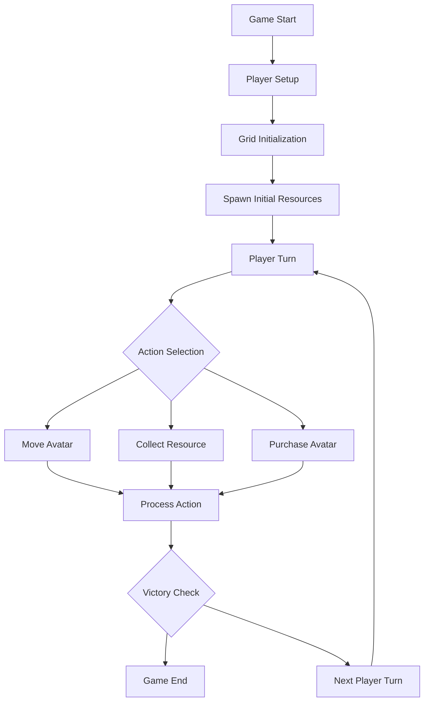
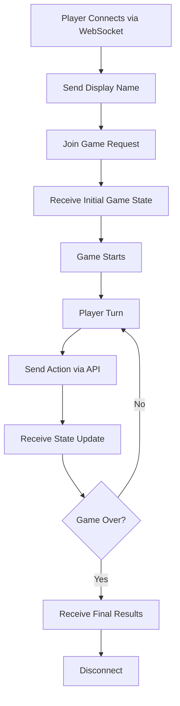
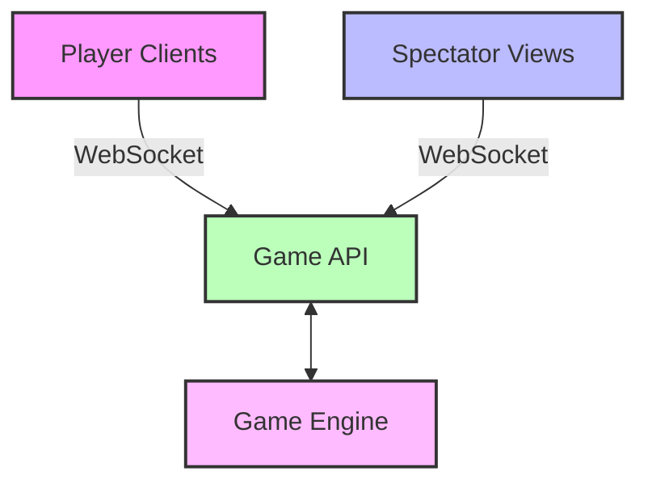

# PyGridFight - MVP Product Requirements Document

## 1. Game Overview

### 1.1 Vision Statement
PyGridFight is a fast-paced, turn-based strategy game focused on resource collection. Players control avatars on a grid-based environment, racing to collect strategic resources to achieve the highest score.

### 1.2 Target Audience
- **Primary**: Programmers and developers seeking a quick, engaging challenge to code AI agents.
- **Secondary**: Teams and organizations looking for a fun, interactive platform for:
    - Team-building activities focused on collaborative AI development.
    - Educational workshops on AI programming and strategic thinking.
- **Use Cases**:
    - Individual AI coding practice and experimentation.
    - Competitive AI programming among colleagues or peers.
    - Structured learning environments for AI concepts.

### 1.3 Game Scope (MVP)
- **Players**: 2-4 players per match
- **Session Duration**: 10-15 minutes per game
- **Platform**: Initial focus on PC (browser-based)
- **Game Type**: Real-time multiplayer with turn-based mechanics

### 1.4 Core Value Proposition
- Quick, engaging matches that reward strategic planning and efficient resource management
- Avatar-based gameplay encourages strategic movement and resource prioritization
- A clear score-based victory condition for straightforward competitive play

## 2. Core Gameplay Mechanics

### 2.1 Grid System
- **Grid Size**: 8x8 or 10x10 grid (scalable based on player count)
- **Movement**: Avatars can move one cell per turn in cardinal directions (up, down, left, right)
- **Positioning**: Avatars cannot occupy the same cell. An occupied cell blocks movement for other avatars.
- **Visibility**: Full grid visibility for all players (no fog of war)

### 2.2 Avatar System
- **Starting Condition**: Each player begins with 1 avatar
- **Avatar Properties**:
  - Movement: 1 cell per turn
- **Avatar Acquisition**: Purchase additional avatars using collected currency
- **Avatar Limit**: Maximum 3-4 avatars per player (prevents overwhelming)

### 2.3 Turn Structure
Each player's turn consists of one action per avatar:
- **Move**: Move avatar to adjacent cell
- **Collect**: Collect resource from current cell
- **Purchase**: Spend currency to buy new avatar (spawns at designated spawn points)

### 2.4 Player Interaction Model
- **Connection Method**: Players connect to the game via WebSocket API
- **Authentication**: Anonymous connection with display name only
- **Communication**: Real-time bidirectional messaging for all game actions
- **API-First Design**: All player interactions happen through a well-defined API interface
- **Action Types**: Move, Collect, Purchase - all sent as API messages
- **State Synchronization**: Players receive real-time game state updates after each action

## 3. Game Systems

### 3.1 Resource System

#### 3.1.1 Currency/Points
- **Function**: Primary scoring mechanism and avatar purchase currency
- **Value**: 1-3 points per resource (varying rarity)
- **Spawn Rate**: 2-3 currency resources per turn cycle
- **Collection**: Instant collection when avatar moves to resource cell

#### 3.1.2 Power-ups
- **Types**:
  - **Speed Boost**: Move 2 cells per turn for 3 turns
- **Duration**: Temporary effects (2-3 turns)
- **Spawn Rate**: 1 power-up every 10 turn cycles
- **Stacking**: Power-ups do stack (multiple active at once)

### 3.2 Resource Spawning
- **Locations**: Random spawn across grid, avoiding occupied cells
- **Frequency**: Resources spawn at end of each complete turn cycle
- **Distribution**: Balanced spawn to prevent clustering in one area
- **Visibility**: All resources visible to all players

### 3.3 Avatar Management
- **Cost**: New avatars cost 5-7 currency points
- **Spawn Points**: Designated safe zones at grid corners/edges
- **Timing**: Avatar purchase occurs during player's turn
- **Strategic Consideration**: Balance between scoring and army building

## 4. Victory Conditions

### 4.1 Score Victory
- **Target Score**: 20-25 points (adjustable based on testing)
- **Achievement**: First player to reach target score wins
- **Timing**: Checked at end of each player's turn

### 4.2 End Game Scenarios
- **Tie Breaking**: If multiple players reach score simultaneously, highest score wins
- **Stalemate Prevention**: Maximum game length of 50 turns (highest score wins)

## 5. User Experience

### 5.1 Game Flow

### 5.2 API-Based Game Flow

### 5.3 Player Interface Requirements
- **Grid Display**: Clear visual representation of 8x8/10x10 grid
- **Avatar Identification**: Distinct colors/symbols for each player's avatars
- **Resource Indicators**: Clear icons for currency and power-ups
- **Status Display**: Current score, active power-ups, available actions
- **Turn Indicator**: Clear indication of whose turn it is
- **API Connection Status**: Visual indicator of connection state

### 5.4 API Specification Requirements
- **Message Format**: JSON-based message structure for all communications
- **Action Messages**: Standardized format for Move, Collect, Purchase actions
- **State Updates**: Complete game state sent after each action
- **Error Handling**: Clear error messages for invalid actions or connection issues
- **Documentation**: OpenAPI/AsyncAPI specification with JSON schemas and examples
- **Message Examples**:
  - Connect: `{"type": "connect", "displayName": "Player1"}`
  - Move: `{"type": "move", "avatarId": 1, "to": {"x": 3, "y": 4}}`
  - State Update: Complete grid state, player scores, avatar positions

### 5.5 Spectator Component
- **Viewing Mode**: Omniscient perspective showing entire game state
- **Real-time Updates**: Receive all game state changes as they happen
- **No Interaction**: Read-only access to game information
- **Display Features**:
  - Complete grid visualization
  - All player positions and resources
  - Current scores and turn indicator
  - Action history for current game
- **Connection**: Separate WebSocket endpoint for spectator connections

### 5.6 Feedback Systems
- **Action Confirmation**: Visual feedback for all player actions
- **Resource Collection**: Immediate visual/audio feedback
- **Victory Announcement**: Prominent end-game messaging

## 6. Technical Considerations

### 6.1 Architecture Overview

### 6.2 Platform Requirements
- **Performance**: Smooth gameplay on mid-range devices
- **Network**: Low-latency WebSocket connections
- **Scalability**: Support for 2-4 concurrent players plus spectators
- **Responsiveness**: Turn actions processed within 1-2 seconds
- **API Latency**: Sub-second message delivery for real-time feel

### 6.3 Implementation Priorities
1. **WebSocket API**: Connection handling and message protocol
2. **Core Grid System**: Movement and positioning mechanics (no shared cells)
3. **Resource System**: Currency collection and scoring
4. **Victory Conditions**: Score-based win detection
5. **Power-ups**: Temporary enhancement system
6. **Spectator Mode**: Read-only game viewing capability
7. **API Documentation**: OpenAPI/AsyncAPI specification

### 6.4 API Design Considerations
- **Message Validation**: Ensure all incoming messages are properly formatted
- **Connection Management**: Handle disconnections and reconnections gracefully
- **State Consistency**: Ensure all clients receive same game state
- **Error Recovery**: Clear error messages and recovery procedures

### 6.5 Balancing Considerations
- **Avatar Cost**: Balance between expansion and scoring
- **Resource Spawn Rate**: Maintain competitive tension
- **Power-up Frequency**: Enhance gameplay without dominating
- **Grid Size**: Optimize for player count and session length

## 7. Success Metrics

### 7.1 Gameplay Metrics
- **Session Length**: Target 10-15 minutes average
- **Player Retention**: Players complete 80%+ of started games
- **Balance**: Resource spawn rates and avatar costs are balanced to ensure fair competition for points.

### 7.2 User Experience Metrics
- **Learning Curve**: New players understand core mechanics within 2 games
- **Engagement**: Players initiate multiple consecutive games
- **Satisfaction**: Positive feedback on game pacing and mechanics

## 8. Future Considerations

### 8.1 Potential Expansions
- **Avatar Types**: Different avatar classes with unique abilities (e.g., faster movement, larger collection radius - non-combat)
- **Map Variants**: Different grid layouts and obstacle placement
- **AI Opponents**: Single-player practice mode (AI focuses on resource collection) (Post-MVP)

---

**Document Version**: 1.1
**Last Updated**: January 2025
**Status**: MVP Definition - Simplified PvE Focus