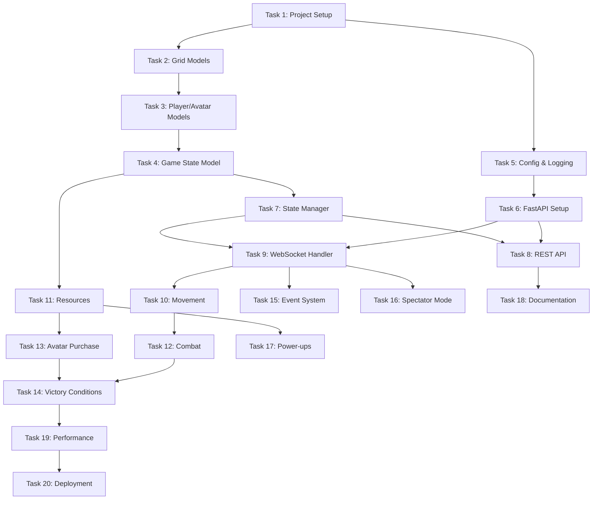

# PyGridFight Task Breakdown

## Overview
This document breaks down the PyGridFight implementation into medium-sized tasks suitable for AI agents. Each task is designed to be completed in 1-2 days, includes testing requirements, and follows a baby-steps approach starting with basic implementations.

## Task List

### Task 1: Project Setup and Basic Structure
**Goal**: Initialize the Python project with uv, create the basic directory structure, and set up development tools.

**Technical Specifications**:
- Initialize project with uv package manager
- Create directory structure as defined in implementation plan
- Set up pyproject.toml with basic dependencies (FastAPI, Pydantic, pytest, structlog)
- Configure ruff for linting and formatting
- Set up pre-commit hooks
- Create Makefile with basic commands
- Add .gitignore for Python projects

**Testing Requirements**:
- Verify project can be installed with `uv pip install -e ".[dev]"`
- Ensure all make commands work (format, lint, test)
- Create a simple test to verify pytest is working

**Example Structure**:
```
PyGridFight/
├── src/pygridfight/__init__.py
├── tests/__init__.py
├── tests/conftest.py
├── pyproject.toml
├── Makefile
├── .gitignore
└── README.md
```

---

### Task 2: Core Domain Models - Basic Grid and Position
**Goal**: Implement the basic Grid and Position domain models with fundamental operations.

**Technical Specifications**:
- Create Position model with x, y coordinates
- Create Grid model with configurable size
- Implement basic grid operations:
  - Check if position is valid (within bounds)
  - Get adjacent positions (cardinal directions only)
  - Calculate distance between positions
- Use Pydantic BaseModel for validation
- Add proper type hints

**Testing Requirements**:
- Test Position creation and validation
- Test Grid bounds checking
- Test adjacent position calculation
- Test edge cases (corners, boundaries)

**Example Code Structure**:
```python
# src/pygridfight/domain/models/grid.py
from pydantic import BaseModel, field_validator

class Position(BaseModel):
    x: int
    y: int

class Grid(BaseModel):
    width: int
    height: int
```

---

### Task 3: Basic Player and Avatar Models
**Goal**: Create Player and Avatar domain models with basic properties and validation.

**Technical Specifications**:
- Create Player model with:
  - Unique ID
  - Display name
  - Score tracking
  - List of avatar IDs
- Create Avatar model with:
  - Unique ID
  - Owner player ID
  - Current position
  - Health (1 HP)
  - Active status
- Implement basic validation rules
- Add helper methods for state queries

**Testing Requirements**:
- Test Player creation and score updates
- Test Avatar creation and position updates
- Test avatar ownership validation
- Test health and active status

**Example Code Structure**:
```python
# src/pygridfight/domain/models/player.py
class Player(BaseModel):
    id: str
    display_name: str
    score: int = 0
    avatar_ids: list[str] = []
```

---

### Task 4: Game State Model and Basic Game Logic
**Goal**: Implement the Game model that combines all domain models and basic game state management.

**Technical Specifications**:
- Create Game model with:
  - Game ID
  - Grid instance
  - Players dictionary
  - Avatars dictionary
  - Game status (waiting, active, finished)
  - Turn tracking
- Implement basic game operations:
  - Add/remove players
  - Create initial avatar for player
  - Check victory conditions (simplified)
  - Get current game state

**Testing Requirements**:
- Test game creation and initialization
- Test player joining/leaving
- Test initial avatar creation
- Test game state queries

---

### Task 5: Configuration and Logging Setup
**Goal**: Implement configuration management using Pydantic Settings and set up structured logging with structlog.

**Technical Specifications**:
- Create GameSettings and ServerSettings using pydantic-settings
- Set up environment variable loading
- Configure structlog with JSON output
- Create logging utilities and decorators
- Implement correlation ID for request tracking

**Testing Requirements**:
- Test configuration loading from environment
- Test default values
- Verify logging output format
- Test log correlation across function calls

**Example Code Structure**:
```python
# src/pygridfight/core/config.py
from pydantic_settings import BaseSettings

class GameSettings(BaseSettings):
    grid_size: int = 8
    max_players: int = 4
```

---

### Task 6: Basic FastAPI Application Structure
**Goal**: Create the basic FastAPI application with health check endpoint and error handling.

**Technical Specifications**:
- Create main FastAPI application
- Add basic middleware (CORS, request ID)
- Implement health check endpoint
- Set up global exception handlers
- Create custom exception classes
- Add OpenAPI customization

**Testing Requirements**:
- Test health check endpoint
- Test CORS headers
- Test exception handling
- Verify OpenAPI documentation generates

**Example Code Structure**:
```python
# src/pygridfight/main.py
from fastapi import FastAPI
app = FastAPI(title="PyGridFight")
```

---

### Task 7: In-Memory Game State Manager
**Goal**: Implement the in-memory storage system for game states and player connections.

**Technical Specifications**:
- Create GameStateManager class
- Implement game CRUD operations:
  - Create new game
  - Get game by ID
  - Update game state
  - Delete game
  - List active games
- Add player connection tracking (preparation for WebSocket)
- Implement game expiration/cleanup
- Thread-safe operations using anyio locks

**Testing Requirements**:
- Test concurrent game creation
- Test game retrieval and updates
- Test game cleanup
- Test thread safety with multiple operations

---

### Task 8: Basic REST API Endpoints
**Goal**: Implement REST endpoints for game management and status queries.

**Technical Specifications**:
- Create game management endpoints:
  - POST /games - Create new game
  - GET /games/{game_id} - Get game state
  - GET /games - List active games
  - DELETE /games/{game_id} - End game
- Implement request/response schemas with Pydantic
- Add proper error responses
- Use dependency injection for GameStateManager

**Testing Requirements**:
- Test all CRUD operations
- Test error cases (game not found, etc.)
- Test request validation
- Integration tests with FastAPI TestClient

---

### Task 9: Basic WebSocket Connection Handler
**Goal**: Implement WebSocket connection handling and basic message routing.

**Technical Specifications**:
- Create WebSocket endpoint /ws/{game_id}
- Implement connection lifecycle:
  - Accept connection
  - Authenticate player (basic)
  - Track connection in GameStateManager
  - Handle disconnection
- Create base message protocol
- Implement message validation with Pydantic
- Add connection error handling

**Testing Requirements**:
- Test WebSocket connection/disconnection
- Test message validation
- Test multiple concurrent connections
- Test connection cleanup on error

---

### Task 10: Player Actions - Movement System
**Goal**: Implement the avatar movement action through WebSocket messages.

**Technical Specifications**:
- Create MoveAction message schema
- Implement movement validation:
  - Check avatar ownership
  - Validate destination is adjacent
  - Check grid bounds
- Update game state after move
- Broadcast state update to all players
- Handle movement errors

**Testing Requirements**:
- Test valid movements
- Test invalid movements (out of bounds, not adjacent)
- Test ownership validation
- Test state broadcasting

**Example Message**:
```json
{
  "type": "move",
  "avatar_id": "avatar-123",
  "to": {"x": 3, "y": 4}
}
```

---

### Task 11: Basic Resource System
**Goal**: Implement resource spawning and collection mechanics.

**Technical Specifications**:
- Create Resource domain model
- Add resources to game state
- Implement resource spawning:
  - Random position selection
  - Avoid occupied cells
  - Configurable spawn rate
- Implement collection action:
  - Check avatar is on resource
  - Add points to player score
  - Remove resource from game
- Create resource-related events

**Testing Requirements**:
- Test resource spawning logic
- Test collection mechanics
- Test score updates
- Test spawn position validation

---

### Task 12: Combat System Implementation
**Goal**: Implement the combat mechanics for avatar battles.

**Technical Specifications**:
- Create AttackAction message schema
- Implement combat validation:
  - Check attacker ownership
  - Validate target is adjacent or same cell
  - Check target exists and is enemy
- Implement combat resolution:
  - Attacker always wins
  - Remove defeated avatar
  - Update game state
- Handle combat events and notifications

**Testing Requirements**:
- Test valid attacks
- Test invalid attacks (out of range, friendly fire)
- Test avatar removal
- Test state updates after combat

---

### Task 13: Avatar Purchase System
**Goal**: Implement the ability to purchase new avatars using collected currency.

**Technical Specifications**:
- Create PurchaseAction message schema
- Implement purchase validation:
  - Check player has enough currency
  - Validate spawn position
  - Check avatar limit per player
- Create new avatar at spawn point
- Deduct currency from player score
- Update game state and broadcast

**Testing Requirements**:
- Test successful purchases
- Test insufficient funds
- Test avatar limit enforcement
- Test spawn point validation

---

### Task 14: Victory Conditions and Game Flow
**Goal**: Implement victory condition checking and game end logic.

**Technical Specifications**:
- Implement score victory check:
  - Check after each scoring action
  - Handle target score configuration
- Implement elimination victory:
  - Check after each combat
  - Detect last player standing
- Implement turn limit and timeout
- Create game end notifications
- Update game status and prevent further actions

**Testing Requirements**:
- Test score victory condition
- Test elimination victory
- Test turn limit
- Test game end state

---

### Task 15: Event System and Game History
**Goal**: Create an event system to track all game actions for replay and debugging.

**Technical Specifications**:
- Create Event base model
- Implement event types for all actions
- Add event storage to game state
- Create event emission system
- Implement event replay capability
- Add event filtering and querying

**Testing Requirements**:
- Test event creation for all actions
- Test event storage and retrieval
- Test event ordering
- Test replay functionality

---

### Task 16: Spectator Mode
**Goal**: Implement read-only spectator connections to games.

**Technical Specifications**:
- Create spectator WebSocket endpoint
- Implement spectator authentication
- Add spectator tracking to GameStateManager
- Ensure spectators receive all state updates
- Prevent spectators from sending actions
- Add spectator count to game info

**Testing Requirements**:
- Test spectator connection
- Test spectator receives updates
- Test spectator cannot send actions
- Test multiple spectators

---

### Task 17: Power-ups System
**Goal**: Implement the power-up mechanics starting with speed boost.

**Technical Specifications**:
- Create PowerUp domain model
- Add power-ups to resource system
- Implement speed boost effect:
  - Track active power-ups per avatar
  - Modify movement validation
  - Handle power-up expiration
- Create power-up related messages
- Update UI state to show active power-ups

**Testing Requirements**:
- Test power-up collection
- Test speed boost mechanics
- Test power-up expiration
- Test multiple active power-ups

---

### Task 18: API Documentation and Client SDK
**Goal**: Generate comprehensive API documentation and create a basic Python client SDK.

**Technical Specifications**:
- Enhance OpenAPI documentation
- Add WebSocket protocol documentation
- Create example messages for all actions
- Build basic Python client SDK:
  - WebSocket connection wrapper
  - Message builders
  - State parsing utilities
- Add usage examples

**Testing Requirements**:
- Test SDK connection
- Test message sending/receiving
- Verify documentation accuracy
- Test example code

---

### Task 19: Performance Optimization and Load Testing
**Goal**: Optimize critical paths and ensure the game can handle multiple concurrent games.

**Technical Specifications**:
- Profile critical operations
- Optimize game state updates
- Implement connection pooling
- Add caching where appropriate
- Create load testing scripts:
  - Simulate multiple games
  - Test concurrent connections
  - Measure response times
- Document performance characteristics

**Testing Requirements**:
- Load test with 10 concurrent games
- Test 40 concurrent connections
- Verify sub-second response times
- Test memory usage

---

### Task 20: Deployment Preparation
**Goal**: Prepare the application for deployment with Docker and production configurations.

**Technical Specifications**:
- Create Dockerfile
- Add docker-compose for local development
- Create production configuration
- Add health checks and readiness probes
- Implement graceful shutdown
- Add environment-specific settings
- Create deployment documentation

**Testing Requirements**:
- Test Docker build
- Test container runs correctly
- Test health endpoints
- Test graceful shutdown

---

## Task Dependencies



## Notes for AI Agents

1. **Independence**: While tasks have dependencies, each task should produce working, tested code that can be integrated incrementally.

2. **Testing First**: Write tests before or alongside implementation to ensure correctness.

3. **Incremental Approach**: Start with the simplest possible implementation that works, then enhance as needed.

4. **Documentation**: Include docstrings and inline comments for complex logic.

5. **Error Handling**: Always include proper error handling and validation.

6. **Type Safety**: Use type hints throughout the codebase.

7. **Clean Code**: Follow KISS, DRY, and YAGNI principles.

---

**Document Version**: 1.0
**Created**: January 2025
**Total Tasks**: 20
**Estimated Timeline**: 4-6 weeks with parallel work